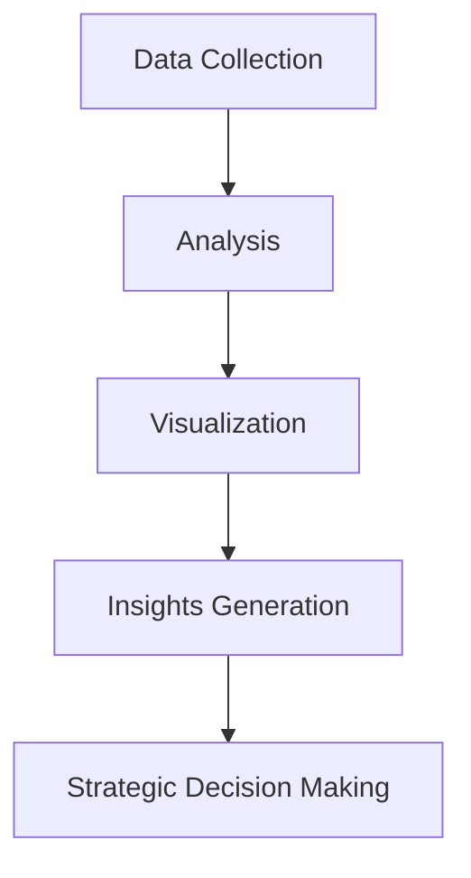
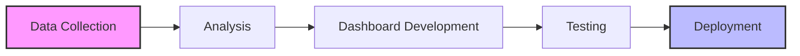

# 🎯 Anime Insights Dashboard 2023

## 📚 Table of Contents
1. [Introduction](#introduction)
2. [Project Context](#project-context)
3. [Dashboard Overview](#dashboard-overview)
4. [Features & Functionality](#features--functionality)
5. [Data Insights](#data-insights)
6. [Business Applications](#business-applications)
7. [Future Enhancements](#future-enhancements)

## 🎮 Introduction
The Anime Insights Dashboard is a powerful analytical tool designed to provide comprehensive insights into the anime industry's trends, viewership patterns, and market dynamics for 2023.

### Key Objectives


## 🌟 Project Context

### Market Overview 2023
| Platform | Market Share | Growth Rate | Top Anime |
|----------|--------------|-------------|-----------|
| Crunchyroll | 45% | +15% | Attack on Titan |
| Netflix | 30% | +22% | Demon Slayer |
| Hulu | 15% | +10% | Spy x Family |
| Others | 10% | +5% | Various |

### Notable Releases Impact
| Anime Title | Viewer Rating | Revenue Impact | Genre |
|-------------|---------------|----------------|--------|
| Attack on Titan: Final Season P4 | 9.8/10 | $$$$ | Action/Drama |
| Jujutsu Kaisen: Shibuya Arc | 9.6/10 | $$$$ | Supernatural |
| Demon Slayer: Swordsmith Village | 9.4/10 | $$$ | Action/Fantasy |

## 🎨 Dashboard Overview

### Real-time Metrics Display
```
📊 Main Dashboard Components:

┌────────────────────┐  ┌────────────────────┐
│  Rating Trends     │  │  Genre Analysis    │
│  [Line Chart]      │  │  [Pie Chart]       │
└────────────────────┘  └────────────────────┘

┌────────────────────┐  ┌────────────────────┐
│  Seasonal Patterns │  │  Viewer Demographics│
│  [Heat Map]        │  │  [Bar Chart]       │
└────────────────────┘  └────────────────────┘
```

### Interactive Features
- 🔍 Dynamic Filtering
- 📅 Time-based Analysis
- 📊 Cross-reference Tools
- 🎯 Custom Metric Creation

## 💡 Features & Functionality

### Primary Analytics Tools
| Feature | Description | Use Case |
|---------|-------------|----------|
| Trend Analyzer | Track rating changes over time | Market analysis |
| Genre Explorer | Analyze genre popularity | Content strategy |
| Season Tracker | Monitor seasonal performance | Release planning |
| Audience Insights | Demographic analysis | Marketing targeting |

### Data Visualization Methods
- **Heat Maps**: Seasonal trending patterns
- **Radar Charts**: Genre distribution
- **Bubble Charts**: Rating vs. Popularity
- **Tree Maps**: Studio performance comparison

## 📈 Data Insights

### Genre Performance Matrix
```
Popular Genres (2023):
Action      ██████████ 95%
Fantasy     ████████── 82%
Romance     ███████─── 70%
Slice of Life██████──── 65%
Horror      ████────── 45%
```

### Seasonal Trends
| Season | Top Genre | Avg. Rating | Viewer Count |
|--------|-----------|-------------|--------------|
| Winter | Fantasy | 8.5 | 15M |
| Spring | Action | 8.8 | 18M |
| Summer | Romance | 8.2 | 16M |
| Fall | Drama | 8.7 | 17M |


## 💼 Business Applications

### Strategic Use Cases
| Sector | Application | Expected Outcome |
|--------|-------------|------------------|
| Production Studios | Content Planning | Optimized releases |
| Streaming Platforms | Content Acquisition | Better ROI |
| Marketing Teams | Campaign Planning | Increased engagement |
| Investors | Market Analysis | Informed decisions |

## 🚀 Future Enhancements

### Planned Features (2024)
- [ ] AI-powered trend prediction
- [ ] Advanced demographic analysis
- [ ] Real-time social media integration
- [ ] Personalized recommendation engine

# Anime Insights Of 2023

## Dataset
[Top 250 Anime 2023 Dataset](https://www.kaggle.com/datasets/gianinamariapetrascu/top-250-anime-2023)

## Table of Contents
1. [Introduction](#introduction)
2. [Project Context](#project-context)
3. [Data and Methodology](#data-and-methodology)
4. [Dashboard Features](#dashboard-features)
5. [Insights and Analysis](#insights-and-analysis)
6. [Business Applications](#business-applications)
7. [Future Enhancements](#future-enhancements)

## Introduction
The Anime Ratings Dashboard is a comprehensive analytical tool designed to provide strategic insights into the anime industry. It transforms complex data into actionable intelligence by:
- Tracking release patterns
- Analyzing genre trends
- Monitoring performance indicators
- Supporting strategic decision-making

### Key Benefits
| Stakeholder | Benefits |
|-------------|----------|
| Producers | Trend analysis for content development |
| Marketers | Audience preference insights |
| Analysts | Real-time market intelligence |

## Project Context
The anime industry is experiencing significant growth due to:

### Market Dynamics
- Expansion of streaming platforms
- Diversifying global audience
- Strategic content acquisition

### Notable 2024 Releases
| Series | Arc/Season |
|--------|------------|
| Attack on Titan | Final Season Part 4 |
| Jujutsu Kaisen | Shibuya Incident Arc |
| Demon Slayer | Swordsmith Village Arc |
| Spy x Family | Ongoing |

### Strategic Insights
The dashboard addresses industry needs by providing:
```
📊 Key Metrics Tracked:
- Genre preferences
- Seasonal trends
- Audience engagement
- Release patterns
- Platform performance
```

### Industry Patterns
| Season | Trend |
|--------|-------|
| Winter | Increased fantasy/isekai popularity |
| Spring | Action genre dominance |
| Summer | Slice-of-life content surge |
| Fall | Mixed genre consumption |

## Future Development
Planned enhancements include:
- Real-time data integration
- Advanced genre analysis
- Platform comparison tools
- Audience behavior tracking
- Release optimization metrics

## Project Status


---
*Note: This dashboard is designed to support strategic decision-making in the anime industry through data-driven insights and analysis.*
